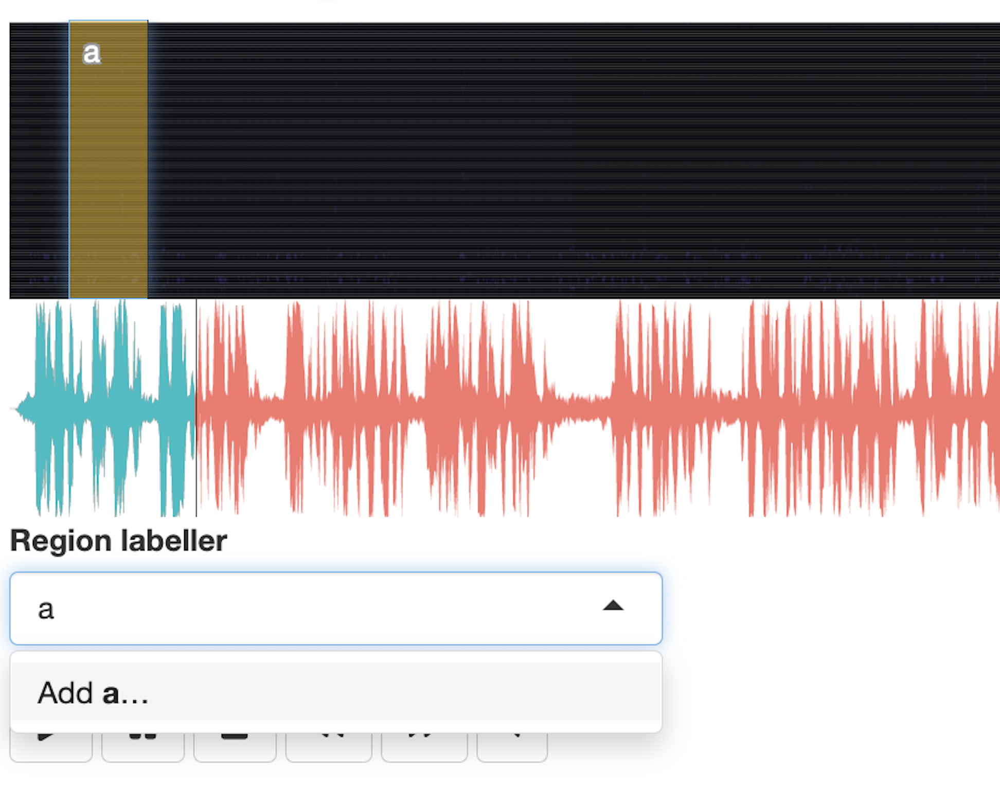

<!-- README.md is generated from README.Rmd. Please edit that file -->

# wavesurfer

<!-- badges: start -->

[](https://CRAN.R-project.org/package=wavesurfer)
[](https://www.tidyverse.org/lifecycle/#experimental)
<!-- badges: end -->


An interactive soundwave player and visualizer with rich set of plugins.
It works well with pipe (%\>%) and can be used in Shiny. It is an
interface of [‘wavesurfer.js’](https://wavesurfer-js.org) JavaScript
library and it is based on [‘htmlwidgets’](http://www.htmlwidgets.org/)
R package.


## Installation and Using in R

``` r
# install.packages("remotes")
remotes::install_github("lingechun/wavesurfer@master")

library(wavesurfer)
annotator_app(
  wavs_folder = " ", 
  annotations_folder = " "
)
```

The goal of `annotator_app()` is to provide an quick way to one start
annotating their audio. It requires two inputs:

  - `wavs_folder` a string with the path to the wave files folder;
  - `annotations_folder` a string with where to store the annotations.

<!-- end list -->


## Annotating data

Running the above codes, you will be re-directed to a browser. To annotate audio, please refer to the following steps.


Step 1: Choose an audio file to begin with. 


Step 2: Drag on the black area above the spectrogram to select the start and end of the region to be labelled. Also, type a name to the label at the box under "Region labeller". 



Step 3: When finishing annotating an audio file, click "Save". You may also delete the annotation by clicking "Clear all regions".


## Deploying on the Web

You may deploy the app on a website. 

Step 1: Sign up or login an account on https://www.rstudio.com/products/shinyapps/.

Step 2: Connect Rstudio to shinyapps.io account using the following codes:

```
install.packages('rsconnect')
library(rsconnect)
setAccountInfo(name='', 
               token='', 
               secret='')
```

which requires three input:
     - `name` a string of your shinyapps.io account name;
     - `token` a string of your password, which can be found by logging to your shinyapps.io account (click the menu on the lefe side: Accoount --> Tokens);
     - `secret` a string of your password, which can be found by logging to your shinyapps.io account (click the menu on the lefe side: Accoount --> Tokens).
          


## Acknowledgement

The main actors that made this package possible were:

  - [htmlwidgets](http://www.htmlwidgets.org/) package;
  - [This tutorial](https://deanattali.com/blog/htmlwidgets-tips/) by
    [Dean Attali](https://deanattali.com/) and his
    [timevis](https://github.com/daattali/timevis) package from which I
    copy pasted massively.
  - [wavesurfer.js](https://wavesurfer-js.org/) library by
    [katspaugh](https://github.com/katspaugh).
  - [This annotator](https://github.com/CrowdCurio/audio-annotator) that
    inspired me for make the spectrogram visualization for wavesurfer.js
    3.0.0. A lot of ctr+C/ctr+V too.
  - [wikiaves.com.br](https://wikiaves.com.br) from where I took audio
    examples for the showcases.

Thank you very much for your work.
